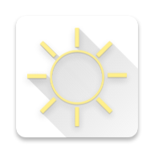
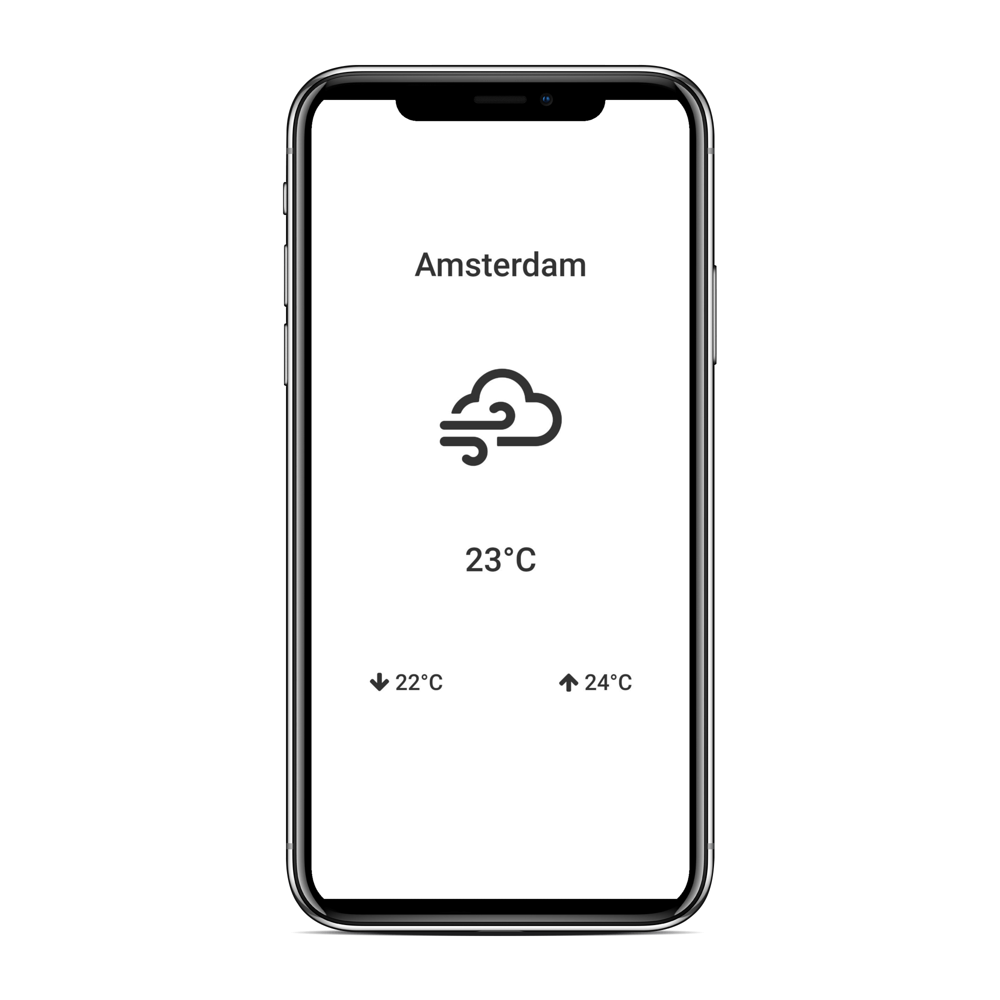

<p align='center'></p>
<h1 align="center">Vueder</h1>
<p align="center">A minimal weather app</p>
<br />
<br />


## About

Vueder is a minimal weather app written in Meteor and is powered by <a href="https://openweathermap.org/" target="_blank">OpenWeatherMap's API</a>.

<br />

<div align="center">

</div>

## Setup

1. **Install Meteor**

    On Linux & Mac:

    ```sh
    > curl https://install.meteor.com/ | sh
    ```

    This will setup [Meteor](http://github.com/meteor/meteor) (including [Node](https://github.com/nodejs/node) and [Mongo](https://github.com/mongodb/mongo) if necessary).

    > _Note:_ Windows users must [download installer](https://www.meteor.com/install).

2. **Clone Repository**

    ```sh
    > git clone https://github.com/juangesino/vueder.git
    > cd vueder
    ```

3. **Install Dependencies**

    If you have npm installed:

    ```sh
    > npm install
    ```

    If you only have meteor:

    ```sh
    > meteor npm install
    ```

4. **Setup Keys**

    In order for the application to use OpenWeatherMap's API, we need to provide an API key.

    Rename the file `/server/keys.js.example` to `/server/keys.js`.

    Open the file and replace `<OPEN-WEATHER-KEY>` with your OpenWeatherMap key. You can get a key <a href="https://openweathermap.org/api" target="_blank">here</a>.

    For info on how to get these variables see <a href="https://docs.particle.io/guide/how-to-build-a-product/authentication/#access-tokens" target="_blank">these docs</a>.

5. **Run**

    While in repository directory run:

    ```sh
    > meteor run
    ```

    Load browser and go to [http://localhost:3000/](http://localhost:3000/)

    Alternatively, you can run:

    ```sh
    > meteor run android-device
    ```

    With an Android phone connected to your computer and with USB debugging enabled to run the server on your computer and install the APK on your phone (connected to the same network). More info about running Meteor on Android <a href="https://guide.meteor.com/mobile.html#running-on-android" target="_blank">here</a> and more info on debugging <a href="https://guide.meteor.com/mobile.html#remote-debugging-android" target="_blank">here</a>.

## Deploy

### Server

The meteor application requires a server. We can do this by deploying the server to Heroku for free.

Follow <a href="https://medium.com/@leonardykris/how-to-run-a-meteor-js-application-on-heroku-in-10-steps-7aceb12de234#.lmg8s462o" target="_blank">these</a> steps to deploy the Meteor app on Heroku.

After that we need to setup an environment variable for the API key. To do so, we need to add the following Config Var to our Heroku application:

```
METEOR_SETTINGS = {"secrets": {"openWeatherKey":"<OPEN-WEATHER-KEY>"} }
```

Where `<OPEN-WEATHER-KEY>` is your OpenWeatherMap API key.

👉🏻 For info on how to set these variables in Heroku see <a href="https://devcenter.heroku.com/articles/config-vars#setting-up-config-vars-for-a-deployed-application" target="_blank">these docs</a>.

**Note**: You will need to deploy this server for the Android app to work.

**Note 2**: The name of the config variable is `METEOR_SETTINGS` and the value for it is everything to the right of the `=` sign.

### Android

To build for Android run:

```sh
> meteor build ../<PATH-TO-BUILD>/vueder --debug --server=https://<YOUR-HEROKU-APP-NAME>.herokuapp.com/
```

Replace `<PATH-TO-BUILD>` with the actual path where you want your build to be generated.
Replace `<YOUR-HEROKU-APP-NAME>` with the name of the Heroku app for your server. If you are not using Heroku, replace the entire `--server` argument with your server's URL.

## Contributing

1. Fork it ( https://github.com/juangesino/vueder/fork )
2. Create your feature branch (`git checkout -b my-new-feature`)
3. Commit your changes (`git commit -am 'Add some feature'`)
4. Push to the branch (`git push origin my-new-feature`)
5. Create a new Pull Request

## License

See [MIT-LICENSE](https://github.com/juangesino/vueder/blob/master/LICENSE).
